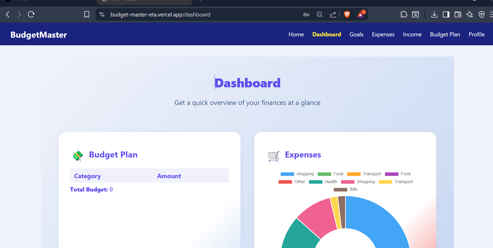

# BudgetMaster – Comprehensive Personal Budget Planner

BudgetMaster is a modern, responsive personal finance tracker and budget planner built with React and Firebase. It empowers individuals to efficiently track income, expenses, and savings goals, providing real-time budget summaries, alerts, and visual insights to help you take control of your finances.

---

## 🚀 Live Demo

- **Firebase Hosting:** [https://budgetmaster12345.web.app](https://budgetmaster12345.web.app)
- **Vercel (if deployed):** [https://budget-master-eta.vercel.app/]

---

## 🖼️ Screenshots

> _Add your screenshots to the `public/` folder and update the image links below._



---

## ✨ Features

- **Authentication:** Secure sign-up and login with Firebase Auth
- **Dashboard:** At-a-glance summary of goals, expenses, income, and budget plan with interactive charts
- **Input Interfaces:** Easy forms for adding income, expenses, and savings goals
- **Real-Time Alerts:** Notifications for overspending and goal progress
- **Visual Charts:** Dynamic, interactive charts for financial trends (Chart.js)
- **Data Persistence:** All data is securely stored in Firebase for cross-device sync
- **Responsive Design:** Works beautifully on desktop and mobile
- **Modern UI:** Clean, vibrant, and user-friendly interface

---

## 📋 App Overview

BudgetMaster is designed to make personal finance management simple and visually engaging:
- **Dashboard:** Visualize your financial health with doughnut charts for expenses and income, a budget table, and a goals tracker.
- **Income & Expenses:** Add, view, and categorize your income and expenses. Instantly see how your spending compares to your budget.
- **Budget Planning:** Set and monitor budgets for different categories.
- **Goals:** Define savings goals and track your progress in real time.

---

## 🛠️ Getting Started

### Prerequisites
- Node.js and npm installed
- A Firebase project (for your own deployment)

### Installation
1. **Clone the repository:**
   ```bash
   git clone <your-repo-url>
   cd trackme-react
   ```
2. **Install dependencies:**
   ```bash
   npm install
   ```
3. **Configure Firebase:**
   - Update `src/firebase.js` with your Firebase project credentials (already set for demo, but replace for production).

### Running the App Locally
```bash
npm run dev
```
Visit [http://localhost:5173](http://localhost:5173) in your browser.

---

## ☁️ Deployment

### Deploying to Firebase Hosting
1. **Login to Firebase CLI:**
   ```bash
   firebase login
   ```
2. **Initialize (if not already):**
   ```bash
   firebase init
   ```
3. **Build your app:**
   ```bash
   npm run build
   ```
4. **Deploy:**
   ```bash
   firebase deploy
   ```

### Deploying to Vercel
1. **Login to Vercel:**
   ```bash
   vercel login
   ```
2. **Deploy:**
   ```bash
   vercel
   ```
3. **Set environment variables** (if needed, e.g., Firebase config).

---

## 🗂️ Project Structure
- `src/components/` – Reusable UI components (Header, Sidebar, Chart, etc.)
- `src/pages/` – Main app pages (Auth, Dashboard, Income, Expenses, Budget, Goals)
- `src/firebase.js` – Firebase configuration and initialization
- `src/App.jsx` – Main app component and routing

---

## 📝 Guidelines
1. Form handling and validation with React hooks
2. Dynamic charts with Chart.js (via react-chartjs-2)
3. Data persistence via Firebase (Firestore)
4. Responsive, elegant UI (CSS modules or frameworks like Tailwind/Bootstrap)

---

## 📢 Contributing
Pull requests are welcome! For major changes, please open an issue first to discuss what you would like to change.

---

## 📄 License
MIT

---

# BudgetMaster